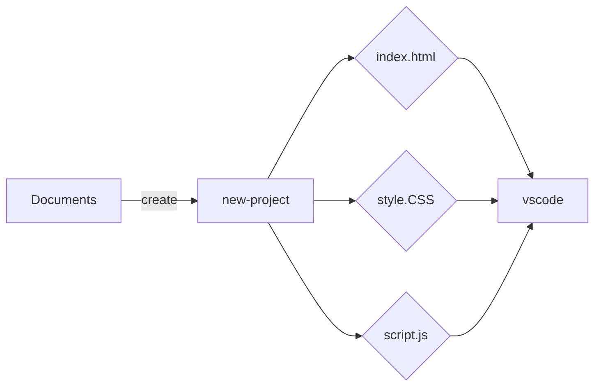

Create-front-folders.vbs create this process:
#### Crée un ficher front dans Documents, contenant; html, css, js et md puis l'ouvre dans vscode

    This script allows you to create a folder in your 'documents', including an html, css, js and readme file, then open it in Vscode, with just a double click.

    coordonateCMD.py affiche les valeurs X et Y en temps réel / Interface
    coordonateInterface.py permet en plus de copier les coordonées d'un click puis de les afficher

##### Tool otto for crypto in [this repository](https://github.com/berru-g/api-crypto-tool-s)
