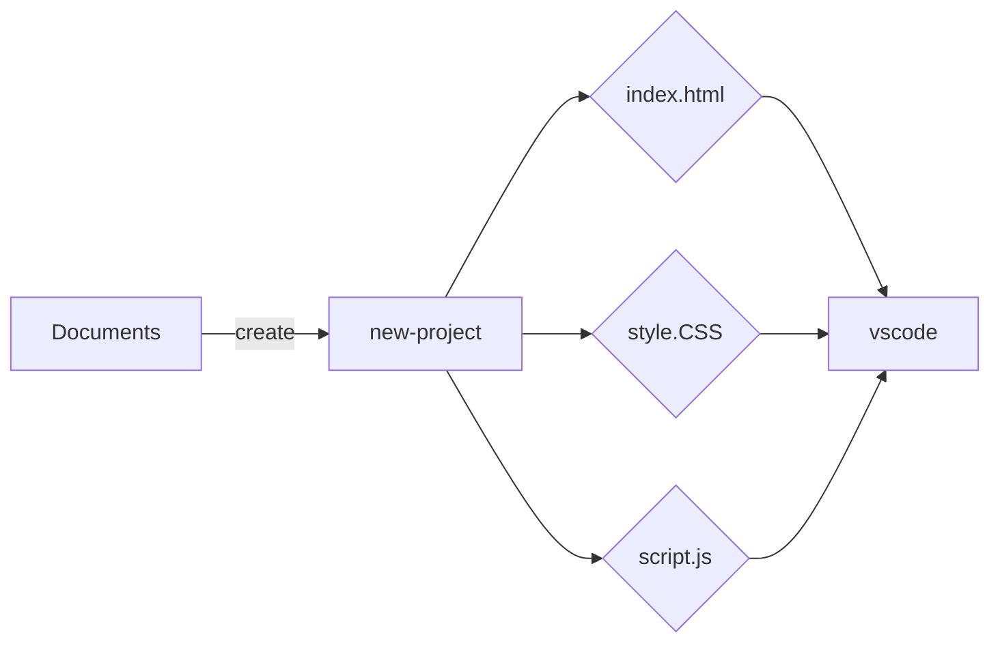

#### Otto

    'Create-front-folders.vbs' is a script allows you to create a folder in your 'documents', including an html, css, js and readme file, then open it in Vscode, with just a double click.

    'coordonateCMD.py' affiche les valeurs X et Y en temps réel / Interface
    'coordonateInterface.py' permet en plus de copier les coordonées d'un click puis de les afficher

    'scrap' Recherche rapide via scrapping
    terminal-scrap-emploi.py

    'preset.vbs' Ouvre un environnement de travail en un click

#### Other Tool's
 - [Alarm crypto](https://github.com/berru-g/api-crypto-tool-s)  
 - [Wallet](https://github.com/berru-g/All-in-one-dashboard)
