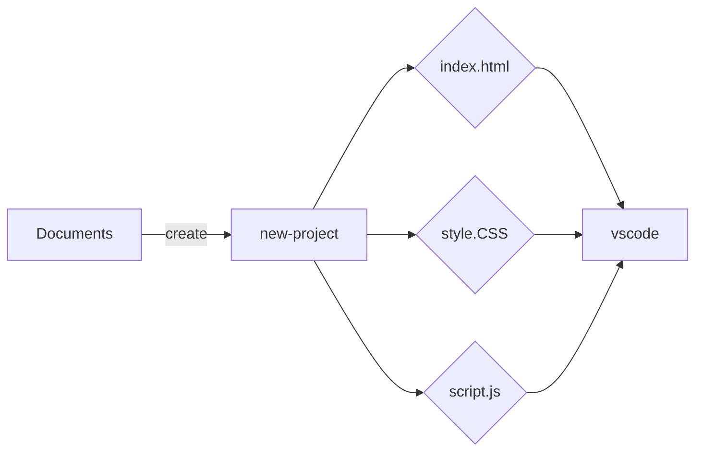

Create-front-folders.vbs create this process:

```mermaid
graph LR
A[Documents] -- create --> B((new-project))
B[new-project] --> C{index.html}
B[new-project] --> D{style.CSS}
B[new-project] --> E{script.js}
C{index.html} --> F[vscode]
D{style.CSS} --> F[vscode]
E{script.js} --> F[vscode]
```

    coordonateCMD.py affiche les valeurs X et Y en temps réel / Interface